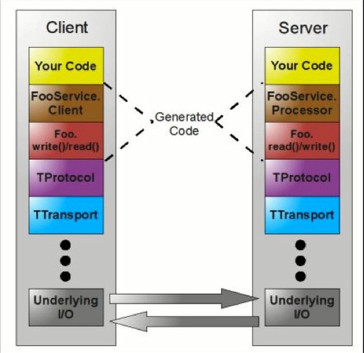

## Apache Thrift原理与架构解析

### Thrift数据类型

Thrift不支持无符号类型，因为很多语言不存在无符号类型。数据类型如下：

| 数据类型   | 描述                                       |      |
| ------ | ---------------------------------------- | ---- |
| byte   | 有符号字节                                    |      |
| i16    | 16位有符号整数                                 |      |
| i32    | 32位有符号整数                                 |      |
| i64    | 64位有符号整数                                 |      |
| double | 64位浮点数                                   |      |
| string | 字符串                                      |      |
| bool   | 布尔类型(TRUE,FALSE)                         |      |
| binary | 对应Java ByteBuffer，未经过编码的字节流              |      |
| list   | 一系列由T类型的数据组成的有序列表，元素可以重复                 |      |
| set    | 一系列由T类型的数据组成的无序列表，元素不可重复                 |      |
| map    | 一个字典结构，key为K类型，value为V类型，相当于Java中的HashMap |      |

集合中的元素可以是除了service之外的任何类型，包括exception。Thrift的三种容器类型支持泛型。

### Thrift工作原理

如何实现多语言之间的通信？

数据传输使用socket（多语言均支持），数据再以特定的格式（string等）发送，接收方进行解析。

定义thrift文件，由thrift文件（IDL）生成双方语言的接口、model，在生成的model以及接口中会有解码编码的代码。

#### 结构体（struct）

和C语言类似，Thrift支持struct类型，目的就是将一些数据聚合在一起，方便传输管理。

IDL文件：Order.thrift

```idl
namespace java com.alibaba.dubbo.demo.api.order

struct Order{
    1:required i32 orderId,
    2:optional string orderTitle
}
```

#### 枚举

枚举的定义形式和Java的Enum定义类似：

```idl
enum Gender {
  MALE,
  FEMALE
}
```

#### 异常

Thrift支持自定义exception，规则与struct一样。

```
exception RequestException {
  1: i32 code;
  2: string reason;
}
```

####服务(Service)

Thrift定义服务相当于Java中创建Interface一样，创建的service经过代码生成命令之后就会生成客户端和服务端的框架代码。定义形式如下：

```idl
namespace java com.alibaba.dubbo.demo.api.order

include "Order.thrift"

service OrderService{
    //相当于Java中的Interface定义的方法
    string ping();
    Order.Order getOrder(1:i32 orderId);
}
```

#### 类型定义

Thrift支持类似C的typedef，如

​	typedef i32 int

​	typedef i64 long

 #### 常量（Const）

Thrift也支持常量定义，使用const关键字：

​	const i32 MAX_RETRIES_TIME = 10

​        const string WEB_SITE = "http://localhost"

#### 命名空间

Thrift的命名空间相当于Java中的package的意思，主要目的是组织代码。Thrift使用关键字namespace定义命名空间：

​	namespace java com.alibaba.dubbo.demo.api.order

格式：namespace 语言名 路径

#### 文件包含

Thrift支持文件包含，相当于C/C++中的include，Java中的import。使用关键字include定义：

​	include "Order.thrift"

#### 注释

Thrift注释方式支持shell风格注释#以及//单行注释和/**/注释

#### 可选和必选

Thrift提供两个关键字required，optional。分别表示对应的字段是必填还是可选。如：

```idl
struct Order{
    1:required i32 orderId,
    2:optional string orderTitle
}
```

一般建议使用optional。

#### 生成代码

进入定义好的.thrift文件。执行thrift -gen java Order.thrift就会生成对应的java文件。

实际在使用中，服务端和客户端使用的协议必须一样，否则调用无法正常完成。

#### Thrift架构图




#### Thrift传输格式

TBinaryProtocol - 二进制格式

<u>**TCompactProtocol - 压缩格式**</u>

TJSONProtocol - JSON格式

TSimpleJSONPRotocol - 提供JSON只写协议，生成的文件很容易通过脚本语言解析

TDebugProtocol - 使用易懂的可读的文本格式，以便于debug

#### Thrift数据传输方式

TSocket - 阻塞式socket

**<u>TFramedTransport - 以Frame位单位进行传输，非阻塞式服务中使用</u>**

TFileTransport - 以文件形式进行传输

TMemoryTransport - 将内存用于IO. Java实现时内部实际使用了简单的ByteArrayOutputStream

TZlibTransport - 使用zlib进行压缩，与其他传输方式联合使用，当前无Java实现

#### Thrift支持的服务模型

TSimpleServer - 简单的单线程服务模型，常用于测试

TThreadPoolServer - 多线程服务模型，使用标准的阻塞式IO

TNonblockingServer - 多线程服务模型，使用非阻塞式IO（需使用TFramedTransport数据传输方式）

**<u>THsHaServer - THsHa引入线程池去处理，其模型把读写任务放到线程池去处理；Half-sync/Half-async的处理模式，Half-async是在处理IO事件上(accept/read/write io)，Half-sync用于handler对rpc的同步处理</u>**

【实际项目中的搭配】

TCompactProtocol + TFramedTransport  + THsHaServer ，需要注意的是，在客户端调用时，也需要采用TCompactProtocol + TFramedTransport才能保证顺利调用。


