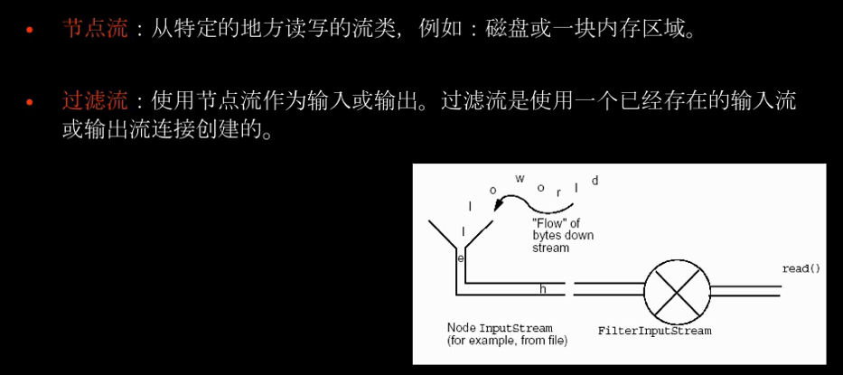
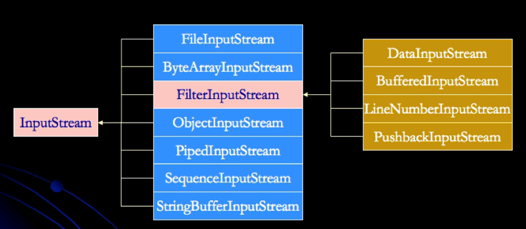
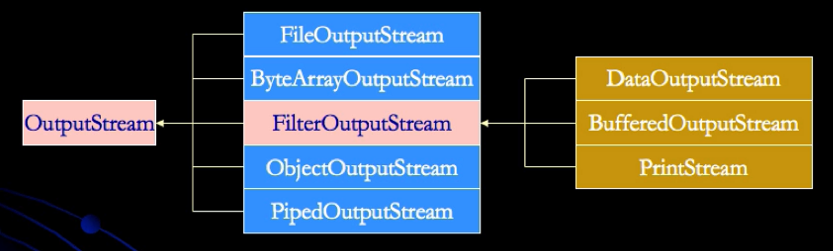
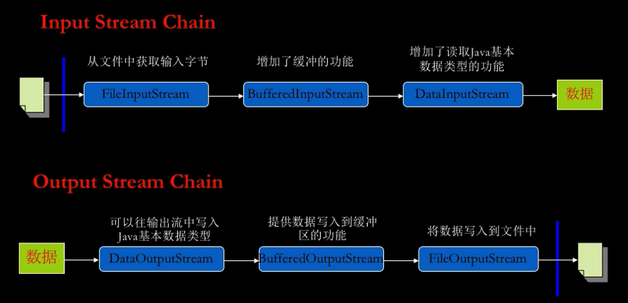

##  Java IO体系架构

对于Java的IO，在最底层，所有的输入/输出都是字节形式的。基于字符的流只是为处理字符提供方便有效的方法。

字节流(Byte Streams)的顶层类：InputStream 和 OutputStream。

字符流(Character Streams)的顶层类：Reader 和 Writer。

### 流分类

Java标准输入的节点流与过滤流：

其中蓝色部分为节点流，直接对接文件或其他输入端，而黄色部分为过滤流，必须在节点流之上做一层封装。

同样的，在输出流端也是类似：

IO流的链接过程如下：

### Java I/O库的设计原则

Java的I/O库提供了一个称做链接的机制，可以将一个流与另一个流首尾相接，形成一个流管道的链接。这种机制实际上是一种被称做Decorator（装饰）设计模式的应用。

通过流的链接，可以动态的增加流的功能，而这种功能的增加是通过组合一些流的基本功能而动态获取的。

为了获取一个I/O对象，往往需要产生多个I/O对象，但是在I/O库中Decorator模式的应用，提供了操作上的便捷性。

### 装饰模式

装饰模式把客户端的调用委派到被装饰类。装饰模式的关键在于这种扩展完全是透明的。

装饰模式是在不必改变原类文件和使用继承的情况下，动态的扩展一个对象的功能。它是通过创建一个包装对象，也就是装饰类包裹真实的对象。

#### 1.装饰模式的角色

①**抽象构件角色(Component)：**给出一个抽象接口，以规范准备接收附加责任的对象，如InputStream。

②**具体构件角色(Concrete Component)：**定义一个将要接收附加责任的类。如节点流FileInputStream。

③**装饰角色(Decorator)：**<u>持有一个构件(Component)对象的引用</u>，并定义一个与抽象构件接口一致的接口。如过滤流的顶层类：FilterInputStream。

④**具体装饰角色(Concrete Decorator)：**负责给构件对象“贴上”附加的责任。如具体的过滤流BufferedInputStream。

#### 2.装饰模式的特点

①**装饰对象和真实对象有相同的接口。这样客户端对象就可以和真实对象相同的方式和装饰对象交互。**

②**<u>装饰对象包含一个真实对象的引用(reference)。</u>**

③**装饰对象接收所有来自客户端的请求。它把这些请求转发给真实的对象。**

④**装饰对象可以在转发这些请求以前或以后增加一些附加功能。**这样就确保了在运行时，不用修改给定对象的结构就可以在外部增加附加的功能。在面向对象的设计中，通常是通过继承来实现对给定类的功能扩展。

#### 3.装饰模式(Decotator)的适用性

①想要透明并且动态地给对象增加新的职责(方法)而又不会影响其他对象

②给对象增加的职责在未来可能会发生改变

③用子类扩展功能不实际的情况下

### 装饰模式VS继承

①装饰模式

- 用来扩展特定对象的功能
- 不需要子类
- 动态
- 运行时分配职责
- 防止由于子类而导致的复杂和混乱
- 更多的灵活性
- 对于一个给定的对象，同时可能有不同的装饰对象，客户端可以通过它的需要选择合适的装饰对象发送消息

②继承

- 用来扩展一类对象的功能
- 需要子类
- 静态
- 编译时分派职责
- 导致很多子类产生
- 缺乏灵活性

