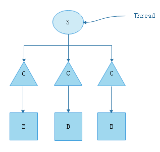
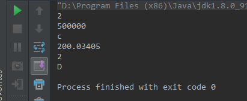
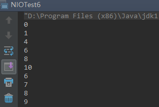
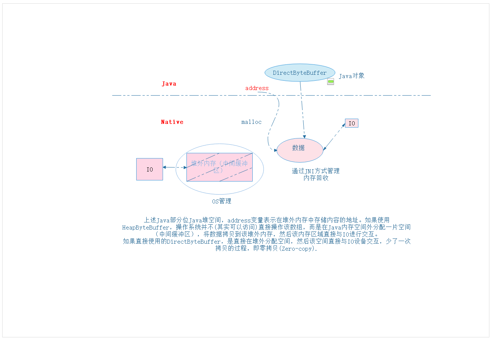

## Java NIO深入分析

### 体系结构

java.io中最为核心的一个概念是流（Stream），面向流的编程。Java中，一个流要么是输入流，要么是输出流，不可能同时既是输入流又是输出流。java.nio中拥有三个核心概念: Selector， Channel， Buffer。在java.nio中，我们是面向块(block)或是缓冲区（buffer）编程的。



Buffer本身就是一块内存，底层实现上，实际是一个数组，数据的读与写都是通过buffer来实现的。

Java.io中是从Stream直接读取，但是在NIO中，是首先将数据从channel读到buffer，程序直接从buffer中读取。
在NIO中读与写之间要做切换，如buffer.flip()。除了数组之外，Buffer还提供了对于数据的结构化访问方式，并可以追踪到系统的读写过程。

Java中的7原生数据类型都有各自对应的Buffer类型，如IntBuffer，LongBuffer，ByteBuffer及CharBuffer等等， Boolean没有BooleanBuffer类型。

### Channel

Channel指的是可以向其写入数据或者是从中读取数据的对象，它类似于java.io的Stream。

所有数据的读写都是通过Buffer来进行的，永远不会出现直接向Channel写入数据的情况，或是直接从Channel读取数据的情况。

与Stream不同的是，Channel是双向的，一个流只可能是InputStream或者是OutputStream，Channel打开后则可以进行读取、写入或者读写。由于Channel是双向的，因此它能更好的反映出底层操作系统的真实情况；在Linux系统中，底层操作系统的通道就是双向的。

1.从内存读

```java
public class NioTest1 {

public static void main(String[] args) {
        IntBuffer buffer = IntBuffer.allocate(10);

        for (int i=0; i < buffer.capacity(); i++) {
            int randomNumber = new SecureRandom().nextInt(20);
            buffer.put(randomNumber);
        }

        buffer.flip(); //做读写切换，必须做

        while (buffer.hasRemaining()) {
            System.out.println(buffer.get());
        }
    }
}
```

2.从文件读

```java
public class NioTest2 {
    public static void main(String[] args) throws IOException {
        FileInputStream fileInputStream = new FileInputStream("NioTest2.txt");
        FileChannel fileChannel = fileInputStream.getChannel();

        ByteBuffer byteBuffer = ByteBuffer.allocate(512);
        fileChannel.read(byteBuffer);

        byteBuffer.flip();

        while (byteBuffer.remaining() > 0) {
            byte b = byteBuffer.get();
            System.out.println("Character: " + (char) b);
        }

        fileInputStream.close();
    }
}
```

3.向文件写

```java
public class NioTest3 {
	public static void main(String[] args) throws IOException {
        FileOutputStream fileOutputStream = new FileOutputStream("NioTest3.txt");
        FileChannel channel = fileOutputStream.getChannel();
        ByteBuffer byteBuffer = ByteBuffer.allocate(512);
        byte[] message = "hello nio, hello".getBytes();
        for (byte aMessage : message) {
            byteBuffer.put(aMessage);
        }
        byteBuffer.flip();
        channel.write(byteBuffer);
        fileOutputStream.close();
    }
}
```

### Buffer

A buffer is a linear, finite sequence of elements of a specific  primitive type.  Aside from its content, the essential properties of a buffer are its capacity, limit, and position.

从上述注释中可以看出，Buffer是一个线性的，包含特定基本类型元素的有限序列。Buffer有三个重要属性：capacity, limit, and position。三者的关系如下：

```java
0 <= mark <= position <= limit <= capacity
```

关于这三个属性：

```java
<p> A buffer's <i>capacity</i> is the number of elements it contains. The
* capacity of a buffer is never negative and never changes.</p>
*
* <p> A buffer's <i>limit</i> is the index of the first element that should
* not be read or written. A buffer's limit is never negative and is never
* greater than its capacity. </p>
*
* <p> A buffer's <i>position</i> is the index of the next element to be
* read or written. A buffer's position is never negative and is never
* greater than its limit. </p>
```

capacity: 指容量，也就是Buffer最多能容纳的元素个数，一旦分配就不再可变。

limit: 可以被读或写的最后一个元素的下一个索引，也就是第一个不可以被读或写的索引。

position: 下一个被读或写的元素的索引。

在前面强调过，每次读和写操作之间必须要做一次flip反转操作，那么为什么要做flip? flip做了什么事情？

```java
public final Buffer flip() {
    limit = position;
    position = 0;
    mark = -1;
    return this;
}
```

可以看到，每次flip操作，实际上是做索引重置。假设当前read 5个字符到Buffer中，需要将这些数据写到channel，那么flip操作后，position指向起始位置0，limit指向buffer的第6个位置（即下标5），写的时候从0->5将数据写出去；反之，如果当前已经将数据写出去，那么此时，position指向第6个字符（即为下标5），那么接下来如果不flip则无法读入数据。所以flip操作保证了数据空间的可用。

【注】核心源代码：Buffer.java

### 文件通道

```java
package com.dongqiang.nio;

import java.io.FileInputStream;
import java.io.FileOutputStream;
import java.nio.ByteBuffer;
import java.nio.channels.FileChannel;

public class NioTest4 {
    public static void main(String[] args) throws Exception {
        FileInputStream fis = new FileInputStream("input.txt");
        FileOutputStream fos = new FileOutputStream("output.txt");
        ByteBuffer buffer = ByteBuffer.allocate(1024);
        FileChannel inputChannel = fis.getChannel();
        FileChannel outputChannel = fos.getChannel();
        System.out.println("position1=" + buffer.position());
        System.out.println("limit1=" + buffer.limit());
        while (true) {
            buffer.clear();  //如果这行代码注释掉，会怎样？
            int read = inputChannel.read(buffer);
            System.out.println("read=" + read);
            if (-1 == read) {
                    break;
            }
            System.out.println("position2=" + buffer.position());
            System.out.println("limit2=" + buffer.limit());
            buffer.flip();
            System.out.println("position3=" + buffer.position());
            System.out.println("limit3=" + buffer.limit());
            outputChannel.write(buffer);
            System.out.println("position4=" + buffer.position());
            System.out.println("limit4=" + buffer.limit());
        }

        inputChannel.close();
        outputChannel.close();
    }
}
```

上述使用了FileChannel，通过输入流Channel获取文件内容，然后将数据写入到输出Channel。input.txt中内容为文本“test”。

上述代码运行正常，如果把buffer.clear(); 去掉后会有什么区别？

去掉后，会一直不停往输出文件写。原因分析如下：

先看clear方法具体实现:

```java
public final Buffer clear() {
        position = 0;
        limit = capacity;
        mark = -1;
        return this;
}
```

可以看到，执行clear会把position重置为0，limit设置为capacity。

有buffer.clear()时，

```java
position1=0
limit1=1024
read=4
position2=4
limit2=1024
position3=0
limit3=4
position4=4
limit4=4
read=-1
```

可以看到，执行一次后，read == -1终止了循环。因为第一次执行后，再次进入循环时，执行buffer.clear()把position设为0，limit = 1024.此时，流中数据已经读取完毕，所以为-1，结束循环。

当去掉buffer.clear()时，

```java
position1=0
limit1=1024
read=4
position2=4
limit2=1024
position3=0
limit3=4
position4=4
limit4=4
read=0
position2=4
limit2=4
position3=0
limit3=4
position4=4
limit4=4
read=0
position2=4
limit2=4
position3=0
limit3=4
position4=4
limit4=4
read=0
position2=4
limit2=4
position3=0
limit3=4
position4=4
limit4=4
read=0
position2=4
limit2=4
```

可以看到，每次没有buffer.clear()时，不会重置position和limit。第一次执行时，读取长度为4，即“test”。执行flip()会把position置为0， limit置为4.然后写入channel后，position变为4.此时，position和limit指向同一个位置，无法再读入，所以读取长度为0。所以进入死循环。

### Buffer深入详解

(1)ByteBuffer类型化put与get

```java
package com.dongqiang.nio;

import java.nio.ByteBuffer;

/**
* ByteBuffer类型化的put与get方法
*/
public class NIOTest5 {
    public static void main(String[] args) {
        ByteBuffer buffer = ByteBuffer.allocate(64);
        buffer.putInt(2);
        buffer.putLong(500000L);
        buffer.putChar('c');
        buffer.putDouble(200.03405D);
        buffer.putShort((short)2);
        buffer.putChar('D');

        buffer.flip();

        System.out.println(buffer.getInt());
        System.out.println(buffer.getLong());
        System.out.println(buffer.getChar());
        System.out.println(buffer.getDouble());
        System.out.println(buffer.getShort());
        System.out.println(buffer.getChar());
    }
}
```

执行结果如下:



上述结果，需要对应取才能得到正确结果。

(2) Slice Buffer与原有Buffer共享底层数组

```java
package com.dongqiang.nio;

import java.nio.ByteBuffer;

/**
* Slice Buffer
*/
public class NIOTest6 {
    public static void main(String[] args) {
        ByteBuffer buffer = ByteBuffer.allocate(10);

        for (int i = 0; i < buffer.capacity(); ++i) {
            buffer.put((byte)i);
        }
        //指定起止位置
        buffer.position(2);
        buffer.limit(6);

        ByteBuffer sliceBuffer = buffer.slice();

        for (int i=0; i < sliceBuffer.capacity(); i++) {
            byte b = sliceBuffer.get(i);
            b *= 2;
            sliceBuffer.put(b);
        }
        //指定绝对位置操作
        buffer.position(0);
        buffer.limit(buffer.capacity());

        while (buffer.hasRemaining()) {
            System.out.println(buffer.get());
        }
    }
}
```

Slice Buffer截取的是从指定的position开始（包含）到limit（不包含）之间的元素，并且操作该buffer会同时改变原buffer的内容，因为底层操作的是同一空间。

执行结果：



（3）只读ByteBuffer

通过调用asReadOnlyBuffer可以将ByteBuffer转成只读

```java
package com.dongqiang.nio;

import java.nio.ByteBuffer;

/**
* 只读buffer，可以随时将一个普通ByteBuffer调用asReadOnlyBuffer转成只读buffer，但反之不行
*/
public class NIOTest7 {
    public static void main(String[] args) {
        ByteBuffer buffer = ByteBuffer.allocate(10);

    
        for (int i=0; i<buffer.capacity(); i++) {
            buffer.put((byte) i);
        }

        System.out.println(buffer.getClass());

        ByteBuffer readOnlyBuffer = buffer.asReadOnlyBuffer();

        System.out.println(readOnlyBuffer.getClass());

        readOnlyBuffer.position(0);
        //readOnlyBuffer.put((byte)2);
    }
}
```

运行结果：

```java
class java.nio.HeapByteBuffer
class java.nio.HeapByteBufferR
```

最后一行，这里如果对只读buffer修改，会抛如下异常：

```java
Exception in thread "main" java.nio.ReadOnlyBufferException
    at java.nio.HeapByteBufferR.put(HeapByteBufferR.java:172)
    at com.dongqiang.nio.NIOTest7.main(NIOTest7.java:25)
    at sun.reflect.NativeMethodAccessorImpl.invoke0(Native Method)
    at sun.reflect.NativeMethodAccessorImpl.invoke(NativeMethodAccessorImpl.java:62)
    at sun.reflect.DelegatingMethodAccessorImpl.invoke(DelegatingMethodAccessorImpl.java:43)
    at java.lang.reflect.Method.invoke(Method.java:498)
    at com.intellij.rt.execution.application.AppMain.main(AppMain.java:147)
```

### NIO堆外内存与零拷贝



上面Java中创建DirectByteBuffer这是在JVM的堆内存中，而下面的native实现，是操作堆外内存，一般是C或C++自己申请和管理的内存。在Buffer.java中定义了一个long address; 只被DirectBuffer使用。   

```java
// Used only by direct buffers
// NOTE: hoisted here for speed in JNI GetDirectBufferAddress
long address;
```

### Selector源码分析

Selector是一个SelectableChannel的多路传输复用器。

Selector的创建可以通过如下方式:

①调用Selector.open(),该方式使用系统默认的java.nio.channels.spi.SelectorProvider选择器提供者来创建一个新的selector。②调用java.nio.channels.spi.SelectorProvider#openSelector()来创建一个自定义的选择器提供者。

一个selector会一直保持打开直到调用close()才会被关闭。

一个selectable channel注册到Selector上是由一个SelectionKey表示。

**Selector的三个selection key集合**

```
1.key set包含的keys表示该Selector与当前注册channel的依赖关系。key <=> (selector -- channel)
2.selected-key set是key set的一个子集。其包含的key对应的channel至少对于key的interest set中标记的操作中的一个是处于就绪状态。可以调用selectedKeys()获取selected-key set。
3.cancelled-key set也是key set的一个子集。其包含的key都是已经被取消但是与之关联的channel还没被解注册。该集合不能被直接访问。
```

新创建Selector时，上述三个几个都是空集合。

调用channel.register()方法，会往Selector的key set中添加一个key。并且，在执行selection操作时，cancelled keys会被从key set中移除。key set本身不能被直接修改。

关闭channel或调用channel.cancel()方法时会触发key的cancel操作，会把key添加到Selector的cancelled-key set。该cancel操作会在Selector的下一次selection操作将channel从Selector上解注册，并且对应的key会从所有key set中删除。

执行selection操作会将keys添加到selected-key set中。调用selected-key set的remove()方法或者调用该set 的iterator的remove()方法可以将key直接从selected-key set中删除。除上述两种方式外不可以通过其他方法移除key，并且在执行selection操作时也不会顺带一并移除key。Keys也不能直接被添加到selected-key set(只能通过selection操作被添加)。

**Selection**

Selection操作是通过select()，select(long)或者selectNow()方法来执行的，有如下三个步骤：

```
1.将cancelled-key set中的key从每一个key set中移除，将与之关联的channel解注册。该步骤最终使cancelled-key集合清空。
2.在selection操作开始时，查询底层操作系统以更新剩下的channel的ready状态，接下来将通过channel执行在key的interest set中标识的操作。这些channel对于interest set中至少一个操作是就绪的,并且对于Channel，下面的两个操作之一会被执行：
	①.如果channel的key不在selected-key set中,它将会被添加到selected-key set，并且它的ready-operation set会被修改精确的标识这些操作。而ready set中任何之前记录的就绪信息均被丢弃。
    ②.否则，如果channel的key已经处于selected-key set中，那么ready-operation set被修改去标识任何新的操作。ready set中任何之前记录的就绪信息都会被保留。
如果在上述第1步开始时key set中的key对应的interest set是空的，那么selected-key set和key的ready-operation sets都不会被更新。    
3.如果在步骤2时有key被添加到cancelled-key set中，那么它们会在步骤1种被处理。
```

selection操作是否阻塞以等待一个或多个channel可用，如果阻塞等待多久，是上述三个方法的唯一区别。

```java
package com.dongqiang.nio;

import java.net.InetSocketAddress;
import java.net.ServerSocket;
import java.nio.ByteBuffer;
import java.nio.channels.SelectionKey;
import java.nio.channels.Selector;
import java.nio.channels.ServerSocketChannel;
import java.nio.channels.SocketChannel;
import java.util.Iterator;
import java.util.Set;

public class NioTest12 {
    public static void main(String[] args) throws Exception {
        int[] port = new int[5];
        port[0] = 50001;
        port[1] = 50002;
        port[2] = 50003;
        port[3] = 50004;
        port[4] = 50005;

        Selector selector = Selector.open();

        for (int i=0; i<port.length; i++) {
            ServerSocketChannel serverSocketChannel = ServerSocketChannel.open();
            serverSocketChannel.configureBlocking(false);
            ServerSocket serverSocket = serverSocketChannel.socket();
            InetSocketAddress address = new InetSocketAddress(port[i]);
            serverSocket.bind(address);

            serverSocketChannel.register(selector, SelectionKey.OP_ACCEPT);
            System.out.println("监听端口：" + port[i]);
        }

        while (true) {
            int numbers = selector.select();
            System.out.println("numbers=" + numbers);

            Set<SelectionKey> selectionKeys = selector.selectedKeys();
            System.out.println("selectedKeys: " + selectionKeys);

            Iterator<SelectionKey> iterator = selectionKeys.iterator();
            while (iterator.hasNext()) {
                SelectionKey selectionKey = iterator.next();

                if (selectionKey.isAcceptable()) {
                    ServerSocketChannel serverSocketChannel = (ServerSocketChannel) selectionKey.channel();
                    SocketChannel socketChannel = serverSocketChannel.accept();
                    socketChannel.configureBlocking(false);

                    socketChannel.register(selector, SelectionKey.OP_READ);

                    iterator.remove();
                    System.out.println("获得客户端连接：" + socketChannel);
                } else if (selectionKey.isReadable()) {
                    SocketChannel socketChannel = (SocketChannel) selectionKey.channel();
                    int byteRead = 0;
                    while (true) {
                        ByteBuffer buffer = ByteBuffer.allocate(512);
                        buffer.clear();
                        int read = socketChannel.read(buffer);
                        if (read <= 0) {
                            break;
                        }
                        buffer.flip();
                        socketChannel.write(buffer);
                        byteRead += read;
                    }
                    System.out.println("读取：" + byteRead + ", 来自：" + socketChannel);
                    iterator.remove();
                }
            }
        }

    }
}
```

可以使用nc工具测试，这里我使用的是netcat-win32-1.11，如命令行启动，然后键入nc localhost 50001即可。


